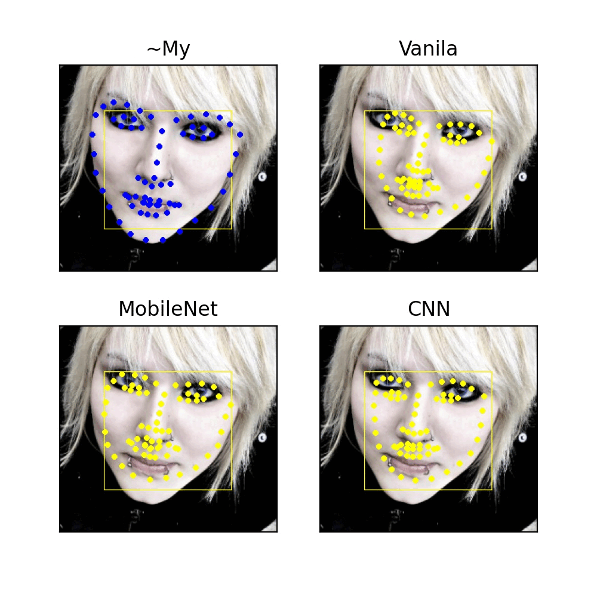

# Fast Face Landmarks 2D and 3D Detector

## Installation
conda create -n fastlmarks python==3.7 tensorflow==2.3    
conda activate fastlmarks    
python setup.py develop

## Face Landmarks 2D Detector
CNN for face landmarks detection with training scripts in focus of robustness against bounding box size and shape
</img>

### Crop-test detector on image 
Make gif like above. You can run crop test on your own image or prepair images from 300W folder.
To do it run 4 and 6 steps from "300W preprocessing" section.
Also, you can find some more validation scripts in Train.ipynb notebook. 
```buildoutcfg
python testtools.py croptest -m vanilla-68/checkpoints/model_final.h5 --img 300W/test_crop/helen/000000.png
```
### Test detector on camera

```buildoutcfg
python testtools.py cam -m vanilla-68/checkpoints/model_final.h5
```
### 300W preprocessing
1. Download datasets (HELEN, LFPW, AFW, IBUG, 300W all parts) from [official site](https://ibug.doc.ic.ac.uk/resources/facial-point-annotations/)
2. Put train sets of HELEN LFPW, AFW, 300W to 300W/train
3. Put test sets of HELEN LFPW, AFW and all IBUG to 300W/test
4. Change working directory:

````buildoutcfg
cd 300W
````

5. To examinate dataset crops run:    

````buildoutcfg
python extract_300w.py train train_crop --max_size 256 --debug
````

6. To created cropped data run for train and test:

````buildoutcfg
python extract_300w.py train train_crop --max_size 256
python extract_300w.py test test_crop --max_size 256
````

### Visualize data

```buildoutcfg
python vis_data.py 300W/train_crop
python vis_data.py 300W/test_crop
```

### Train 2D detector


## Face Landmarks 3D Detector
Fast convolutional net for 3D face landmarks detection with training scripts. 
Procedure of automated labeling data with 2D landmarks is provided. 
Final 3D model is trained on this "synthetic data".

### Test detector on camera
Fully convolutional model trained on 300W dataset (see...)
```buildoutcfg
python testtools.py cam -m fconv3d-12/checkpoints/model_final.h5
```

### 3D landmarks generation
You have two options: 
1. convert 300W dataset using instructions from "300W preprocessing" 
2. use your own data in proper format (with "annotations.txt" file)    
Using havy and precise model new 3D annotations are generated. Below with 300W example:
```buildoutcfg
python datatools.py create3d 300W/test_crop/
python datatools.py create3d 300W/train_crop/
```
### Train 3D detector